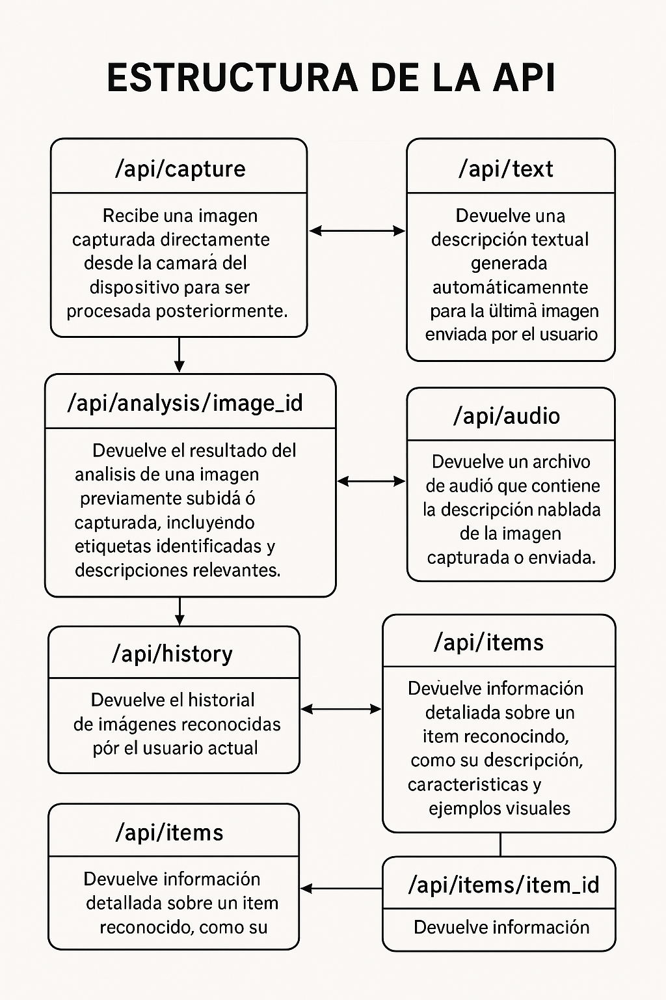

## Identificacion de odas las rutas de APIs necesarias

## [POST] /api/v1/images/capture
 - **Descripción:** Recibe una imagen capturada desde la cámara del dispositivo para ser procesada.
 
 **Autenticación requerida:** Sí

 **Cuerpo de la solicitud (Request body):**
 {
 }
  "image": "base64 string de la imagen",
  "user_id": "ID del usuario"
 Respuesta exitosa: 200 OK
 {
 }
  "status": "success",
  "data": { ... },
  "message": "opcional"
  
 **Posibles errores:** 
 **- 400 Bad Request:** Solicitud mal formada
 **- 404 Not Found:** Recurso no encontrado
 **- 500 Internal Server Error:** Error del servidor

----------------------

## [GET] /api/v1/images/{image_id}/analysis
 **Descripción:** Devuelve el análisis de una imagen específica.
 
 **Autenticación requerida:** Sí

 **Parámetros de ruta:**
 - image_id: ID de la imagen a analiza

 **Respuesta exitosa:** 200 OK

 Estructura de la API - Documentación Técnica
 {
 }
  "status": "success",
  "data": { ... },
  "message": "opcional"
 
 **Posibles errores:**
 - 400 Bad Request: Solicitud mal formada
 - 404 Not Found: Recurso no encontrado
 - 500 Internal Server Error: Error del servido

 ------------------

## [GET] /api/v1/multimedia/by-tag/{tag}

 **Descripción:** Devuelve recursos multimedia asociados a una etiqueta.
 
 **Autenticación requerida:** No
 
 **Parámetros de ruta:**
 - tag: Nombre de la etiqueta
 
 **Respuesta exitosa:** 200 OK

 {
 }
  "status": "success",
  "data": { ... },
  "message": "opcional"
 
 **Posibles errores:**
 - 400 Bad Request: Solicitud mal formada
 - 404 Not Found: Recurso no encontrado
 - 500 Internal Server Error: Error del servido

---------------

 ## [GET] /api/v1/images/{image_id}/text
 
 **Descripción:** Devuelve una descripción textual generada para la imagen.
 
 **Autenticación requerida:* Sí
 
 **Parámetros de ruta:**
 - image_id: ID de la imagen
 
 **Respuesta exitosa:** 200 OK
 
 {
 }
  "status": "success",
  "data": { ... },
  "message": "opcional"
 
 **Posibles errores:**
 - 400 Bad Request: Solicitud mal formada
 - 404 Not Found: Recurso no encontrado
 - 500 Internal Server Error: Error del servidor
 
 ---------

 ## [GET] /api/v1/images/{image_id}/audio
 **Descripción:** Devuelve un archivo de audio con la descripción hablada de la imagen.
 
 **Autenticación requerida:** Sí
 **Parámetros de ruta:**
 - image_id: ID de la imagen
 
 **Respuesta exitosa:** 200 OK
 {
  "status": "success",
  "data": { ... },
  "message": "opcional
 }

  **Posibles errores:**
  - 400 Bad Request: Solicitud mal formada
  - 404 Not Found: Recurso no encontrado
  - 500 Internal Server Error: Error del servido

## [GET] /api/v1/users/{user_id}/history
 **Descripción:** Devuelve el historial de imágenes reconocidas por el usuario.
 
 **Autenticación requerida:** Sí
 
 **Parámetros de ruta:**
 - user_id: ID del usuario
 
 **Respuesta exitosa:** 200 OK

 {
 }
  "status": "success",
  "data": { ... },
  "message": "opcional"
 
 **Posibles errores:**
 - 400 Bad Request: Solicitud mal formada
 - 404 Not Found: Recurso no encontrado
 - 500 Internal Server Error: Error del servidor

-----------

 ## [GET] /api/v1/items
 
 **Descripción:** Devuelve una lista de categorías o ítems reconocibles.
 
 **Autenticación requerida:** No
 
 **Respuesta exitosa:** 200 Ok

{
 Estructura de la API - Documentación Técnica
  "status": "success",
  "data": { ... },
  "message": "opcional"
 }

 **Posibles errores:**
 - 400 Bad Request: Solicitud mal formada
 - 404 Not Found: Recurso no encontrado
 - 500 Internal Server Error: Error del servidor

 ## [GET] /api/v1/items/{item_id}
 **Descripción:** Devuelve información detallada sobre un ítem específico.
 
 **Autenticación requerida:** No
 
 **Parámetros de ruta:** 
 
 - item_id: ID del ítem
 **Respuesta exitosa:** 200 OK
 
 {
 }
  "status": "success",
  "data": { ... },
  "message": "opcional"

 **Posibles errores:**
 - 400 Bad Request: Solicitud mal formada
 - 404 Not Found: Recurso no encontrado
 - 500 Internal Server Error: Error del servidor

-------------------------------------

 ## Ejemplo de respuesta estructurada con vínculos (Hypermedia)
 
  **Este es un ejemplo de una respuesta enriquecida con vínculos a otros recursos relacionados:**
 {
  "id": 123,
  "title": "What is REST",
  "content": "REST is an architectural style for building web services...",
  "published_at": "2023-11-04T14:30:00Z",
  "author": {
    "id": 456,
    "name": "John Doe",
    "profile_url": "https://example.com/authors/456"
  },
  "comments": {
    "count": 5,
    "comments_url": "https://example.com/posts/123/comments"
  },
  "self": {
    "link": "https://example.com/posts/123"
  }
 }

------------------

## Consideraciones de Diseño
 
- **Nomenclatura:**

  - Todos los endpoints inician con el prefijo común `/api/` para mantener consistencia y claridad.
  - Se utilizan nombres de rutas en minúsculas, descriptivos y específicos del recurso o funcionalidad.
 
- **Estructura Jerárquica:**

  - Las rutas reflejan una estructura lógica agrupada por funcionalidades (ej. `capture`, `analysis`, `multimedia`, `text`, `audio`).
  - Las rutas con parámetros dinámicos están claramente identificadas (ej. `{image_id}`, `{tag}`).

- **Principios de RESTful**

  - Para los principios de RESTful se recomiendo utilizar los siguiente:
    - GET: Se usa para leer
    - POST: Se utiliza para crear
  - Se anexa un ejemplo en caso tal los endpoint de text y audio esten fuertemente ligados a una imagen:
    - GET /api/images/{image_id}/text
    - GET /api/images/{image_id}/audio

- **Versiones**

  - Para las versiones de la api se recomienda utilizar v como la variable de version e ir incrementando en 1 para las difernetes versiones v1, v2, v3, v4, etc... un ejemplo seria: /api/v1//images

para una opcion visual pueden verlo siguiendo el siguiente enlace a la imagen:

